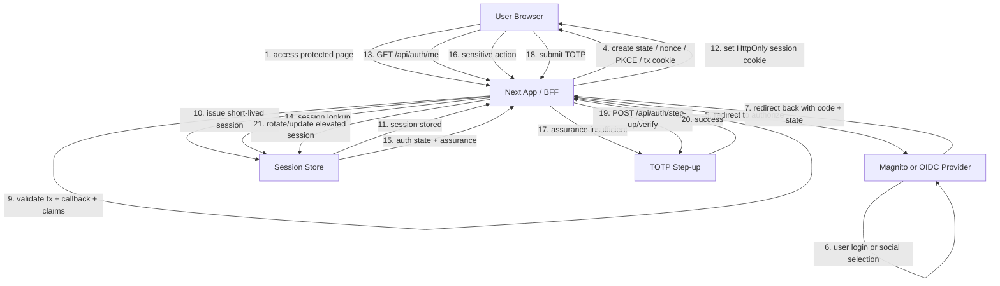

# 認証再設計 指示書 日本語版

## 目的

このプロジェクトの認証フローを、`catapult-next` および `frourio-next` の学習に適した、標準的かつ拡張可能な構成へ整理する。

目標とする設計は以下のとおり。

- ベース認証: `OIDC Authorization Code Flow + PKCE`
- セッション管理: 短寿命のサーバーサイドセッションとセッションローテーション
- Step-up 認証: まずは `TOTP` を採用する
- 将来拡張: `Passkey / WebAuthn` を追加し、どちらかを選択可能にできる構成にする

このプロジェクトは `catapult-next` と `frourio-next` を深く理解することを目的としているため、フレームワーク依存の回避策よりも、標準的で責務が明確な設計を優先すること。

## 必須制約

- 実装は `frourio-next` の基準・流儀に合わせること。
- `frourio-next` によって生成されるファイルは改修対象にしないこと。
- 特に `frourio.server.ts`、`frourio.client.ts`、およびその他の生成物は編集しないこと。
- 生成ファイルを実装の主戦場にしないこと。
- API 定義を変える必要がある場合は、生成元となる手書きファイルを修正し、その後に再生成すること。
- `frourio-next` はこのプロジェクトの前提では `3xx` のリダイレクトレスポンスを `frourioSpec.res` で明示しなくてもよい。
- 特にリダイレクト主体の endpoint では、`frourio.ts` 内で `3xx` を無理に定義しなくてよい。参考として `src/app/api/auth/login/frourio.ts` の構成に合わせること。
- endpoint 構成は `login`、`callback`、`me` を中心に維持すること。
- Step-up 用 endpoint を 1 本追加すること。
- Step-up はまず `TOTP` で実装するが、将来的に `Passkey / WebAuthn` を追加しやすい設計にすること。

## 想定する endpoint 構成

以下の責務に沿って実装またはリファクタリングすること。

| Endpoint | 責務 | 備考 |
| --- | --- | --- |
| `/api/auth/login` | 認可開始 | `state`、`nonce`、PKCE、transaction cookie を生成し、OIDC 認可 endpoint へリダイレクトする |
| `/api/auth/callback` | コールバック検証とアプリセッション発行 | callback 内容と transaction context を検証し、必要な claim を確認して server session cookie を発行する |
| `/api/auth/me` | 現在の session / 認証状態の照会 | 認証済みか、どの保証レベルか、step-up が必要かを返す |
| `/api/auth/step-up/verify` | TOTP による step-up 実行 | 認証済み session を前提に TOTP を検証し、session の保証レベルを引き上げる |

これらの責務は混在させないこと。認可開始、callback 検証、session 状態確認を同じ endpoint に混ぜないこと。

## 推奨アーキテクチャ

BFF 的なサーバー主導の認証アーキテクチャを採用する。

### ベースログインフロー

1. ユーザーが保護対象リソースへアクセスする。
2. アプリが server session を確認する。
3. 有効な session がなければ、`/api/auth/login` が OIDC 認可開始処理を行う。
4. アプリは一時的な transaction context を生成・保存する。
   - `state`
   - `nonce`
   - PKCE `verifier`
   - 必要なら遷移元パス
5. アプリは OIDC provider へリダイレクトする。
6. Provider は `/api/auth/callback` に `code` と `state` を付けてリダイレクトする。
7. callback は transaction 情報と provider 応答を検証する。
8. アプリは独自の短寿命 server session を発行する。
9. ブラウザには provider token をフロント管理させず、アプリの session cookie のみを持たせる。

### TOTP による Step-up フロー

1. ユーザーはすでに通常の認証済み session を持っている。
2. 高リスク操作の実行時に、現在の保証レベルが十分かを確認する。
3. 不十分なら `/api/auth/step-up/verify` を要求する。
4. ユーザーが TOTP コードを送信する。
5. サーバーが現在の認証済みユーザーに対して TOTP を検証する。
6. 成功したら session の保証レベルを更新、または session をローテーションして step-up 完了状態を反映する。
7. 引き上げられた保証状態は無期限ではなく、時間制限を持たせること。

### 将来の Passkey 対応

保証レベルのモデルは、TOTP 専用に固定しないこと。

将来的に少なくとも以下を扱えるようにすること。

- TOTP
- Passkey / WebAuthn
- route や操作種別に応じたポリシー選択

session モデルや命名を TOTP 固定にしないこと。

## endpoint ごとの責務境界

### `/api/auth/login`

この endpoint が担うべきこと:

- OIDC 認可フローの開始
- callback 検証に必要な transaction state の生成
- callback 相関のための一時 cookie またはサーバー側 transaction state の作成
- PKCE を含む認可 URL の組み立て
- IdP へのリダイレクト

この endpoint が担うべきでないこと:

- 最終的な認証済み app session の発行
- 認可開始以上のユーザー同定処理
- step-up ロジック

### `/api/auth/callback`

この endpoint が担うべきこと:

- `code`、`state`、必要なら provider の `error` の受領
- callback パラメータと保存済み transaction context の照合
- `state` などの相関・改ざん防止情報の検証
- 必要に応じた PKCE verifier の利用
- 返却された identity 情報や token claims の検証
- 検証成功後の app session 作成
- ログイン成功時の session identifier のローテーション
- アプリ内へのリダイレクト

この endpoint が担うべきでないこと:

- 汎用的な session 状態照会 endpoint を兼ねること
- session 確立に不要な長期的ユーザープロファイル取得を抱え込むこと
- step-up を別設計にしているのに、TOTP 検証までここに混ぜること

### `/api/auth/me`

この endpoint が担うべきこと:

- 現在の app session の確認
- 認証済みかどうかの返却
- フロントに必要な最小限のユーザー情報返却
- step-up 済みかどうかを含む保証状態の返却
- 高リスク操作に追加認証が必要かどうかの返却

この endpoint が担うべきでないこと:

- 認可開始リダイレクト
- 副作用として保証レベルを変更すること
- callback 検証

### `/api/auth/step-up/verify`

この endpoint が担うべきこと:

- すでに通常認証済み session が存在することを前提にする
- TOTP コードを受け取る
- 現在の認証済みユーザーに対して TOTP を検証する
- 成功時に session の保証レベルを更新する
- 必要に応じて step-up 成功後の session 状態をローテーションまたは強化する

この endpoint が担うべきでないこと:

- ベースログインフローの置き換え
- 匿名状態から通常ログイン済み状態への直接昇格
- 秘密情報や enroll 用情報の不要な露出

## フロー図

## 実装にコードとして表現すべきセキュリティ要件

以下はチェックリストを返すためではなく、コード構造や挙動に落とし込むための要件である。

### 認可開始と callback 相関

- login 開始時と callback 時を transaction state により相関させること
- `state` により callback 偽造や取り違えを防ぐこと
- ID token を扱う場合は `nonce` を利用できるようにすること
- Authorization Code Flow では PKCE を利用すること
- 一時 transaction state は短寿命かつ安全に保存すること
- transaction state が欠損、期限切れ、不正形式、不一致の場合は fail closed にすること

### session モデル

- フロント管理 token ではなく、アプリ管理の server session を使うこと
- ブラウザに見せる情報は最小限の session handle にとどめること
- session TTL は短く保つこと
- 認証成功時に session identifier をローテーションすること
- step-up 成功後にも保証状態に応じて session を更新またはローテーションできること
- session モデルに assurance 関連メタデータを持てるようにすること

### assurance モデル

session 表現では少なくとも以下を表現できるようにすること。

- 認証済みかどうか
- 認証時刻
- 保証レベル
- どの認証手段を用いたか
- step-up 完了済みか
- step-up 完了時刻
- step-up の有効期限内か

将来の Passkey 対応を阻害するような TOTP 固定の命名や設計は避けること。

### TOTP Step-up

- 最初の step-up 実装は TOTP とすること
- TOTP は通常ログイン後の追加確認として扱うこと
- 高リスク操作または高保証状態要求時に限って使うこと
- step-up 状態はセッション全期間で永続化せず、有効期限を明示すること

### Cookie と request hardening

- session handle は `HttpOnly` cookie で扱うこと
- 必要に応じて `Secure` cookie を使うこと
- redirect フロー要件を踏まえた `SameSite` を選ぶこと
- cookie の scope、expiration、path を明示すること
- 状態変更系の認証済み request には CSRF 対策を考慮すること

### ログと監査性

- 認可開始、callback 成功/失敗、session 発行、session 拒否、step-up 成功/失敗に関するログや監査イベントを残すこと
- 秘密情報、token、TOTP seed などの機微情報はログに残さないこと
- 資格情報を漏らさずにデバッグ可能なログ設計にすること

## frourio-next 実装ガイダンス

- `frourio.ts` の定義は、実際の request 契約および非リダイレクトレスポンス契約に合わせること
- `3xx` redirect を `frourioSpec.res` に無理に表現しないこと
- redirect endpoint では、route 実装側で runtime redirect を返し、`frourio.ts` は最小限に保つこと
- 手書きロジックは `route.ts` に置き、手書き schema は `frourio.ts` に置くこと
- 生成された server/client wrapper は使い捨ての生成物として扱うこと

## リファクタリング方針

既存の auth endpoint を起点にしつつ、責務を以下の形に整理すること。

- `login` は認可開始専用にする
- `callback` は検証と session 発行専用にする
- `me` は session 状態照会専用にする
- `step-up/verify` は保証レベル引き上げ専用にする

従来の責務混在がこの目標設計と矛盾する場合は、既存の混在責務を温存しないこと。

## Codex に期待する成果物

Codex は上記制約と構造に従って認証再設計を実装すること。

実装は以下を満たすこと。

- `frourio-next` スタイルの開発フローを維持すること
- 生成物を編集しないこと
- login と callback の責務を明示的かつ監査しやすくすること
- TOTP ベースの step-up を導入しつつ、将来 Passkey を追加できる設計にすること
- 学習用の参照実装として読みやすいコードにすること

## 非目標

- `catapult-next` や `frourio-next` から離れた設計へ変えないこと
- 必要性がない限り endpoint 構成自体を大幅に変更しないこと
- 明快さよりトリッキーな近道を優先しないこと
- OIDC ベースフローを捨てて TOTP 単独の認証システムにしないこと