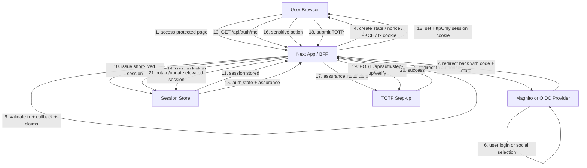

# Auth Redesign Instructions For Codex

## Goal

Refactor the authentication flow in this project to a standard and extensible architecture that matches `catapult-next` and `frourio-next` usage.

The target design is:

- Base authentication: `OIDC Authorization Code Flow + PKCE`
- Session management: short-lived server-side session with session rotation
- Step-up authentication: use `TOTP` first
- Future extensibility: allow switching or expanding step-up to `Passkey/WebAuthn`

This project is intended for learning `catapult-next` and `frourio-next`, so prefer a standard and explicit design over framework-specific workarounds.

## Mandatory Constraints

- Follow `frourio-next` conventions for implementation.
- Do not modify any generated files produced by `frourio-next`.
- In particular, do not edit any `frourio.server.ts`, `frourio.client.ts`, or other generated outputs.
- Do not treat generated files as implementation targets.
- If API definitions need to change, update the hand-written source files that are used as generator inputs, then regenerate.
- `frourio-next` does not handle `3xx` responses as part of `frourioSpec.res` in the way we want here, so redirect responses do not need to be declared in `frourio.ts`.
- For redirect-oriented endpoints such as `login`, it is acceptable for `frourio.ts` to omit `res` declarations for `3xx` responses. Use `src/app/api/auth/login/frourio.ts` as the reference pattern.
- Keep the endpoint structure centered on `login`, `callback`, and `me`.
- Add one endpoint for step-up verification using TOTP.
- Design the step-up layer so that Passkey/WebAuthn can be added later without redesigning the overall flow.

## Target Endpoint Structure

Implement or refactor toward the following API responsibilities.

| Endpoint | Responsibility | Notes |
| --- | --- | --- |
| `/api/auth/login` | Start authorization | Generate `state`, `nonce`, PKCE values, transaction cookie, and redirect to OIDC authorization endpoint |
| `/api/auth/callback` | Validate callback and issue app session | Validate callback inputs and transaction context, exchange code if needed, validate claims, then issue server session cookie |
| `/api/auth/me` | Return current session/authentication state | Determine whether the user is authenticated, what assurance level they have, and whether step-up is required |
| `/api/auth/step-up/verify` | Perform TOTP-based step-up | Verify TOTP against the authenticated user/session and upgrade the current session assurance state |

Keep these responsibilities strict. Avoid mixing authorization-start behavior, callback validation, and session introspection in the same endpoint.

## Recommended Architecture

Use a BFF-style server-managed auth architecture.

### Base login flow

1. User accesses a protected resource.
2. App checks the server session.
3. If no valid session exists, `/api/auth/login` starts OIDC authorization.
4. App generates and persists temporary transaction context:
   - `state`
   - `nonce`
   - PKCE `verifier`
   - optional requested return path
5. App redirects to the OIDC provider.
6. Provider redirects back to `/api/auth/callback` with `code` and `state`.
7. Callback validates the transaction and provider response.
8. App issues its own short-lived server session.
9. Browser stores only the app session cookie, not the raw provider tokens as frontend-managed auth state.

### Step-up flow with TOTP

1. User is already authenticated with the base session.
2. When the user performs a high-risk action, the app checks whether the current session assurance is sufficient.
3. If not sufficient, require `/api/auth/step-up/verify`.
4. User submits a TOTP code.
5. Server verifies the TOTP code for the currently authenticated user.
6. On success, rotate or update session state to mark step-up as completed.
7. The elevated assurance should be time-bounded.

### Future Passkey support

Design the assurance model so that TOTP is not hardcoded as the only step-up method.

Represent assurance in a way that can later support:

- TOTP
- Passkey/WebAuthn
- policy-driven selection by route or action

Do not tightly couple session state to TOTP-only semantics.

## Responsibility Boundaries Per Endpoint

### `/api/auth/login`

This endpoint should:

- start the OIDC authorization flow
- generate transaction state needed for callback validation
- create temporary cookie or server-side transaction state for callback correlation
- build the authorization URL with PKCE
- redirect the browser to the IdP

This endpoint should not:

- issue the final authenticated application session
- perform user identity resolution beyond preparing the authorization request
- contain step-up logic

### `/api/auth/callback`

This endpoint should:

- receive `code`, `state`, and optional provider error parameters
- validate callback parameters against the saved transaction context
- verify anti-forgery/correlation data such as `state`
- use PKCE verifier where required
- validate returned identity data or token claims
- create the application session after successful validation
- rotate session identifiers on successful login
- redirect the user back into the app

This endpoint should not:

- double as a generic session status endpoint
- own long-term user profile querying beyond what is required to establish the session
- perform TOTP verification directly unless explicitly part of a separate step-up flow design

### `/api/auth/me`

This endpoint should:

- inspect the current app session
- return authentication status
- return user identity summary needed by the frontend
- return assurance-related state, such as whether the current session has completed step-up
- return whether reauthentication or step-up is required for sensitive operations

This endpoint should not:

- start authorization redirects
- mutate assurance state as a side effect
- perform callback validation

### `/api/auth/step-up/verify`

This endpoint should:

- require an already authenticated base session
- accept a TOTP code
- validate the TOTP code against the current authenticated user
- update the current session assurance level on success
- rotate or harden session state as needed after successful step-up

This endpoint should not:

- replace the base login flow
- issue a normal anonymous-to-authenticated login by itself
- expose secrets or enrollment material unnecessarily

## Flow Diagram

## Security Requirements To Encode In The Implementation

Implement the code so that these requirements are expressed in the behavior and structure.

### Authorization start and callback correlation

- Correlate login initiation and callback using transaction state.
- Use `state` to prevent request forgery and callback confusion.
- Use `nonce` if ID token validation is involved.
- Use PKCE for the authorization code flow.
- Store temporary transaction state safely and with a short lifetime.
- Ensure callback processing fails closed if transaction state is missing, expired, malformed, or mismatched.

### Session model

- Use application-managed server sessions rather than relying on frontend-managed tokens.
- Store only the minimum browser-visible session handle in cookies.
- Keep session TTL short.
- Rotate session identifiers after successful authentication.
- Rotate or refresh assurance-related session state after successful step-up.
- Make room in the session model for assurance metadata.

### Assurance model

The session representation should be able to express at least:

- authenticated or not
- authentication time
- assurance level
- authentication methods used
- whether step-up has been completed
- when step-up was completed
- whether step-up is still valid

Avoid naming or modeling that makes future Passkey support awkward.

### TOTP step-up

- TOTP is the initial step-up method to implement.
- Treat TOTP as additional verification for an already authenticated user.
- Keep step-up bounded to sensitive operations or elevated assurance states.
- Make step-up expiration explicit rather than permanent for the life of the session.

### Cookie and request hardening

- Use `HttpOnly` cookies for session handles.
- Use `Secure` cookies when appropriate.
- Apply suitable `SameSite` policy based on the redirect flow requirements.
- Be explicit about cookie scope, expiration, and path.
- Consider CSRF protections where state-changing authenticated requests exist.

### Logging and auditability

- Add logs and audit-relevant events around authorization start, callback success/failure, session issuance, session rejection, and step-up success/failure.
- Avoid logging secrets, tokens, TOTP seeds, or raw sensitive data.
- Make debugging possible without leaking credentials.

## frourio-next Implementation Guidance

- Keep `frourio.ts` definitions aligned with the actual request and non-redirect response contracts.
- Do not attempt to model `3xx` redirect responses in `frourioSpec.res` if that conflicts with `frourio-next` conventions in this project.
- For redirect endpoints, favor runtime redirect responses from the route implementation while keeping `frourio.ts` minimal.
- Keep hand-written route logic inside `route.ts` and hand-written schema definitions inside `frourio.ts`.
- Treat generated server/client wrappers as disposable outputs.

## Refactoring Direction

Use the existing auth endpoints as the starting point, but refactor their responsibilities toward the target model.

Expected direction:

- `login` becomes authorization start only
- `callback` becomes validation plus session issuance only
- `me` becomes session state inspection only
- `step-up/verify` becomes assurance elevation only

Do not preserve prior mixed responsibilities if they conflict with this target architecture.

## Expected Deliverables

Codex should implement the auth redesign with the above constraints and structure.

The implementation should:

- preserve `frourio-next`-style development flow
- avoid editing generated files
- make the login and callback flow explicit and auditable
- introduce TOTP-based step-up in a way that does not block future Passkey support
- keep the code readable as a learning-oriented reference implementation

## Non-Goals

- Do not redesign the project away from `catapult-next` or `frourio-next`.
- Do not replace the endpoint structure with a completely different auth surface unless unavoidable.
- Do not optimize for clever shortcuts over clarity.
- Do not build a TOTP-only auth system that bypasses the OIDC base flow.